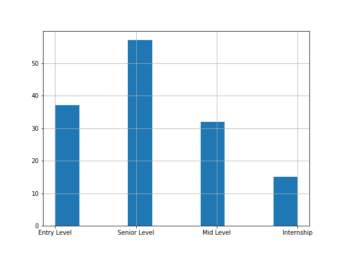

# Augment job information
Given the list of jobs (title, description and seniority level),
but some of the jobs are missing the seniority level.

Write an application which fills in the gaps - restores the missing seniority level.

Extra:

1. Explain the choice of language / technology stack.
2. Explain the choice of approach and algorithm.
3. Estimate quality of the result.

## Problem Definition
The goal of the task is to fill the missing Seniority level using title and description.
The given dataset has in total 216 records out of which 75 records don't have the seniority levels. 
There are four different seniority levels which makes the problem ``Multi-Class``classification. 

## Exploratory Data Analysis
Below are some of the findings I found after doing some exploratory analysis.

1. Dataset is imbalanced, we have to balance the dataset before we apply any model.
   
   
2. Distribution of title and description length
         
              Title                      Description
          count    216.000000       count     216.000000
          mean      30.328704       mean     1764.819444
          std       15.077422       std      1069.707932
          min        6.000000       min         2.000000
          25%       19.000000       25%       973.000000
          50%       28.000000       50%      1788.000000
          75%       37.000000       75%      2493.250000
          max       95.000000       max      5927.000000

Title and variance are varying in lengths, If we consider the max lenght then our dataset will be sparse in nature so we have to make a decision what is the max length we should consider.

3. Dataset itself is too small, any kind of model we use the performance will still be poor.

## Dataset preparation

I am using two different pre-processing techniques. Firstly, using TF-IDF processing to establish a baseline and then using  `Glove` word-embedding.

Following cleaning steps are applied:

1) Tokenization
2) Stop words removal
3) Punctuation removal
4) Removing words smaller than 3 characters
5) Removing digits.

# Model Train and Evaluation

I choose below models based on the intuition and from the past experience.

1) MultinomialNB  --> as a baseline model
2) RandomForestClassifier
3) XGBClassifier
4) Transformer models(BERT and RoBERTA)

I  didn't attempt to use Deep learning models like GRU or LSTM because the data is too small and they don't perform well when we have too less data.
Instead, I choose to fine tune transformer models ``BERT`` and `RoBERTA` models. However, the results are not that great.

XGBClassifier works better than other models chosen. So, I choose this as my final model and evaluate the results on the test dataset.
Below, I have put all the results I got from training different models with different pre-processing.

Due to the imbalance issue, models were biasing towards `Senior Level`. I used over sampling to overcome this issue.

## With TF-IDF

### NaiveBayes

* Mean Accuracy validation set: 0.581527093596059
* Mean Precision validation set: 0.5976675001243967
* Mean Recall val set: 0.581527093596059
* Mean F1 validation set: 0.5708487400726637

Classification Report: 
               
                precision    recall  f1-score   support

           0       0.60      0.43      0.50         7
           1       0.75      1.00      0.86         3
           2       0.25      0.33      0.29         6
           3       0.82      0.75      0.78        12

### RandomForest
* Mean Accuracy validation set: 0.4958128078817734
* Mean Precision validation set: 0.47218926230969843
* Mean Recall val set: 0.4958128078817734
* Mean F1 validation set: 0.46626449147298177

Classification Report: 
               
                precision  -   recall -  f1-score -  support

           0       0.50      0.25      0.33         8
           1       0.67      0.67      0.67         3
           2       0.25      0.17      0.20         6
           3       0.59      0.91      0.71        11

### XGBClassifier
* Mean Accuracy validation set: 0.56871921182266
* Mean Precision validation set: 0.5805389397138165
* Mean Recall val set: 0.56871921182266
* Mean F1 validation set: 0.5537449196587663

Classification Report: 
               
                precision    recall  f1-score   support

           0       0.50      0.57      0.53         7
           1       1.00      1.00      1.00         3
           2       0.25      0.14      0.18         7
           3       0.62      0.73      0.67        11

## With Word Embeddings

### RandomForest

* Mean Accuracy validation set: 0.5600985221674877
* Mean Precision validation set: 0.550079169598874
* Mean Recall val set: 0.5600985221674877
* Mean F1 validation set: 0.546976412081347

    Classification Report: 
                   precision    recall  f1-score   support
    
     Entry Level       0.60      0.43      0.50         7
      Internship       0.75      1.00      0.86         3
       Mid Level       0.60      0.43      0.50         7
    Senior Level       0.64      0.82      0.72        11

### XGBClassifier
* Mean Accuracy validation set: 0.6096059113300493
* Mean Precision validation set: 0.6432119346412305
* Mean Recall val set: 0.6096059113300493
* Mean F1 validation set: 0.5983259170559952
  
        Classification Report: 
                       precision    recall  f1-score   support
        
         Entry Level       0.60      0.43      0.50         7
          Internship       1.00      0.67      0.80         3
           Mid Level       0.50      0.57      0.53         7
        Senior Level       0.69      0.82      0.75        11

## Transformer models

## BERT

* Training Accuracy Epoch: 40.42553191489362
* Precision: 0.16342236306020824
* Accuracy: 0.40425531914893614
* Recall: 0.40425531914893614
* F1 score: 0.23275306254029654
  
      Classification Report: 
                  precision    recall  f1-score   support

           0       0.00      0.00      0.00        37
           1       0.00      0.00      0.00        15
           2       0.00      0.00      0.00        32
           3       0.40      1.00      0.58        57

## Explaining the results

XGBClassifier is performing better with the Glove embedding. On the other hand, transofmer models are not performing well the reason might be is that they have limitation 
with the sequence length, we have long sequences for descriptions but we are using only 512 lenght.

## Improvements

1. XGBClassifier can be further improved by tuning the hyperparameters correctly again.
2. Fine-tuning a transformer models which accepts longer sequence.
3. Apply some more pre-processing techniques.

## How to use the tool

1. Clone the repository
    
    git clone https://github.com/smartrecruiters-coding/ict-job-levels-kantharaju-narayanappa

2. Install the requirements 
    
    pip3 install -r requirments.txt

3. Run the application
    

    >export PYTHONPATH=~/ict-job-levels-kantharaju-narayanappa/src  
    > To Train  
    > >python3 main.py --model xgb_model --pre-processing tfidf  
    > To test  
    > >python3 main.py --model xgb_model --test  
    > TO parameter.tuning(Supports only xgb tuning)  
    > >python3 main.py --tune  

## Extras:

Explain the choice of language / technology stack.
    I am using Python language because Python has strong ecosystem for Datascience tools
    and also I have strong Python programming experience and I enjoy using Python.

Explain the choice of approach and algorithm.
Based on the size of the dataset, I chose models which performs well on the smaller datasets.

Estimate quality of the result.

Quality of the results are good because of the dataset size. Results and more explanation is provided in the corresponding sections.

Note: I haven't tested the Transformer models after I moved the models from the Jupyter notebook. But, they work fine if you run the notebook.